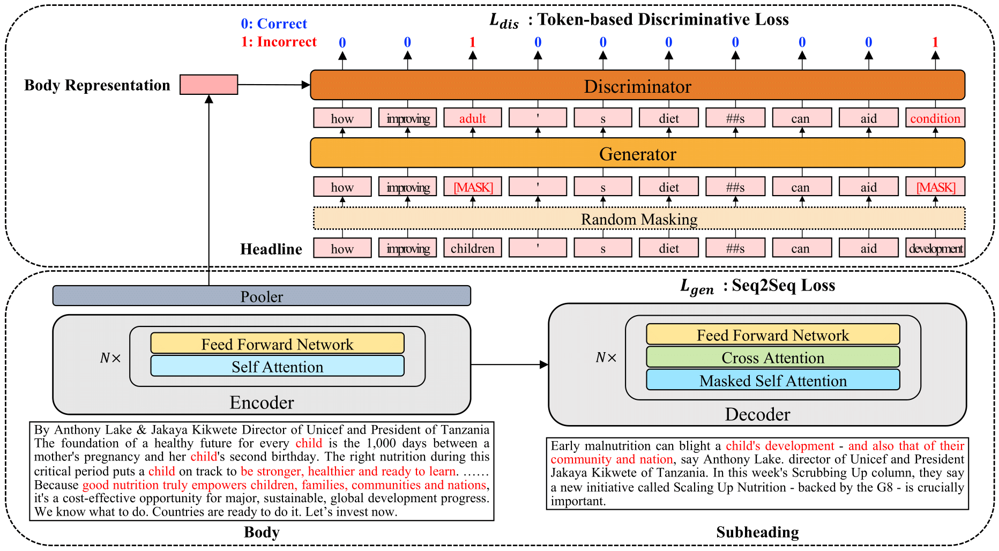

# Headline-Token-based-Discriminative-Learning-for-Subheading-Generation-in-News-Article

This is the pytorch implementation of **Headline Token based Discriminative Learning for Subheading Generation in News Article**

# Overview

<p align="center">
  
</p>

The news subheading summarizes an article's contents in several sentences to support the headline limited to solely conveying the main contents. So, it is necessary to generate compelling news subheadings in consideration of the structural characteristics of the news. In this paper, we propose a subheading generation model using topical headline information. We introduce a discriminative learning method that utilizes the prediction result of masked headline tokens. Experiments show that the proposed model is effective and outperforms the comparative models on three news datasets written in two languages. We also show that our model performs robustly on a small dataset and various masking ratios. Qualitative analysis and human evaluations also shows that the overall quality of generated subheadings improved over the comparative models.

Our code is based on the code of [DIFFCSE](https://github.com/voidism/DiffCSE). Please refer to their repository for more detailed information.

## Pre-requisite

* konlpy=0.6.0
* kss=3.4.2
* matplotlib=3.5.1
* pandas=1.4.1
* pytorch-lightning=1.2.4
* scikit-learn=1.1.0
* seaborn=0.11.2
* torch=1.7.1
* tqdm=4.64.0
* transformers=4.3.3
* wandb=0.12.16
* nltk=3.4.5
* datasets=2.2.1
* bert-score=0.3.11

## DATASET

Please request through https://yonhap-news-dataset.s3.ap-northeast-2.amazonaws.com/yonhapnews/

## IMPLEMENTATION

```console
sh train_main.sh
```

